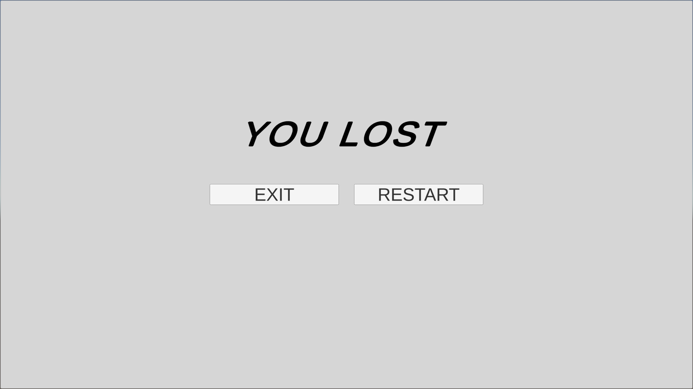

# Obstacles Avoider!!
Game developed using Unity along with C#.

The goal of the game is to avoid all the obstacles and reach the finish line.

## How to Play?
Press Statrt in the Home Screen:

Use the right and left arrows to avoid the obstacles:

Lose State; Hiting object 

Win state; Reaching the yellow door:

